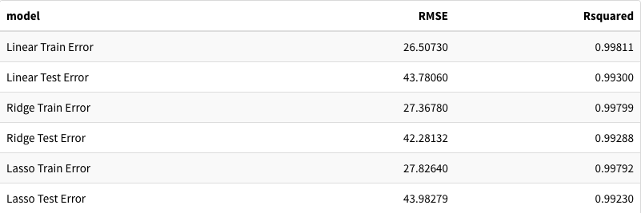
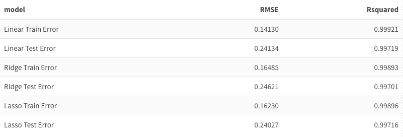

```{r setup, include=FALSE}
knitr::opts_chunk$set(echo = FALSE, warning = FALSE, message = FALSE)
library(tidyverse)
library(ggplot2)
library(dplyr)
library(caret)
library(leaps)
library(caTools)
library(tidymodels)
library(glmnet)
library(pls)
library(forecast)
library(GGally)
library(plyr)
library(readr)
library(repr)
library(knitr)
library(kableExtra)

set.seed(420)
knitr::opts_chunk$set(fig.width=12, fig.height=8) 
```

## Background

- Breast Cancer Diagnosis Data
- Predict Diagnosis of Tumor based on features
- Reduce Type II Error (False-Negatives)
- Feature Selection

## Data

- Data collected from "Breast Cancer Wisconsin (Diagnostic) Data Set" from Kaggle
- Response: Diagnosis
    - Benign: (Noncancerous Cells)
    - Malignant (Cancerous Cells)
- Predictors: 10 variables split into 3 categories:
    - Mean 
    - Standard Error (SE)
    - Worst: Mean of 3 largest values of a variable
- Training/Test Data Split 60/40

## Variable Descriptions
- Radius: Average Distance from cell center to cell perimeter
- Texture: Standard deviation of gray-scale values; brightness of pixel of cell
- Perimeter: Distance around nucleus boundary
- Area: Area of the nucleus
- Smoothness: Variation in cell's radial lengths
- Compactness: The Perimeter^2/Area
- Concavity: Size of the indention in nucleus boundary
- Concave Points: Number of points on indented section of nucleus boundary
- Symmetry: Deviation of the nuclei shape from the ideal measurement
- Fractal Dimension: Measurement of irregularity in nucleus boundary

## EDA

- Different measurements of each variable are correlated

- Relationship with Diagnosis visible for each measurement

## Classification Analysis: Danny

## Classification Analysis: Austin

## Regression Analysis: Ethan

- Austin Top 5 Importance Variables
    - *area_mean
    - *area_worst
    - *concave.points_mean
    - texture_mean
    - *radius_worst
- Danny Top 5 Importance Variables
    - concave.points_worst
    - *concave.points_mean
    - *area_worst
    - *area_mean
    - *radius_worst
    
## Correlation Plot

```{r}
dataTemp <- read.csv("breast_cancer_diagnostic_data.csv")
datatemp2 <- dataTemp %>% select_if(~ !any(is.na(.)))
dataTot <- datatemp2[,!names(datatemp2) %in% c("id")]

testtemp <- read.csv("test.csv")
testTot <- testtemp[,!names(testtemp) %in% c("id")]

traintemp <- read.csv("training.csv")
trainTot <- traintemp[,!names(traintemp) %in% c("id")]
```

```{r, results=FALSE, echo=FALSE, message=FALSE, warning=FALSE}
dataE <- dataTot
corr_df <- dataE[,c('area_worst', 'area_mean', 'concave.points_mean', 'radius_worst')]
ggpairs(corr_df)
```

## Models

- Calculating Training and Test Set Error
    - Linear Regression
    - Ridge Regression
    - Lasso Regression

## area_mean

{width = "50%}


## area_worst

{width = "50%}

## concave.points_mean
{width = "50%}

## radius_worst
{width = "50%}

## Works Cited

- Breast Cancer Wisconsin (Diagnostic) Data Set:
    - https://www.kaggle.com/datasets/uciml/breast-cancer-wisconsin-data?datasetId=180&sortBy=voteCount
- Definition of Features (Variables):
    - https://www.causeweb.org/usproc/sites/default/files/usclap/2017-2/Evaluating_Benign_and_Malignant_Breast_Cancer_Cells_from_Fine-Needle_Aspirates.pdf