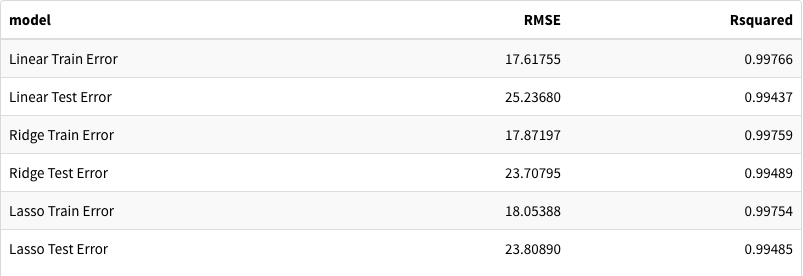
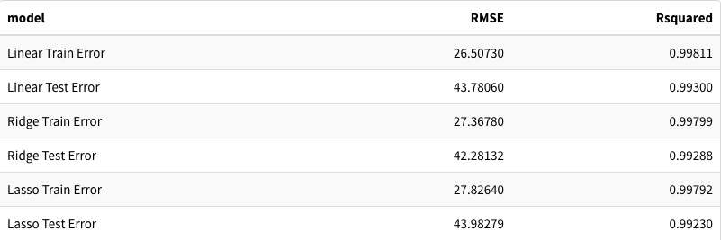
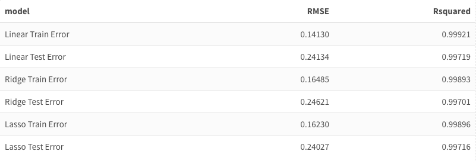

```{r setup, include=FALSE}
# Import packages
library(tidyverse)
library(ggplot2)
library(GGally)
library(knitr)
library(boot)
library(caret)
library(randomForest)
library(e1071)
library(class)
set.seed(420)
knitr::opts_chunk$set(echo = FALSE, warning = FALSE, message = FALSE, fig.width = 14, fig.height = 8)
```

## Background

- Breast Cancer Diagnosis Data
- Predict Diagnosis of Tumor based on features
- Feature Importance/Selection
- Reduce Type II Error (False-Negatives)

## Data

- Data collected from "Breast Cancer Wisconsin (Diagnostic) Data Set" from Kaggle
- Response: Diagnosis
    - Benign: (Noncancerous Cells)
    - Malignant (Cancerous Cells)
- Predictors: 10 variables each with 3 measurements:
    - Mean 
    - Standard Error (SE)
    - Worst: Mean of 3 largest values of a variable
- Training/Test Data Split 60/40

## Variable Descriptions

- Radius: Average Distance from cell center to cell perimeter
- Texture: Standard deviation of gray-scale values; brightness of pixel of cell
- Perimeter: Distance around nucleus boundary
- Area: Area of the nucleus
- Smoothness: Variation in cell's radial lengths
- Compactness: The Perimeter^2/Area
- Concavity: Size of the indention in nucleus boundary
- Concave Points: Number of points on indented section of nucleus boundary
- Symmetry: Deviation of the nuclei shape from the ideal measurement
- Fractal Dimension: Measurement of irregularity in nucleus boundary

## EDA

```{r}
### Packages

library(tidyverse)
library(GGally)
library(ggplot2)
library(tidyr)
library(tidymodels)
library(vip)
library(caTools)
library(xgboost)
library(discrim)
library(glmnet)
library(kableExtra)

### Gathering Data

train <- read.csv("training.csv")
test <- read.csv("test.csv")

train |>
  select(-id) -> train

test |>
  select(-id) -> test

train$diagnosis <- as.factor(train$diagnosis)
test$diagnosis <- as.factor(test$diagnosis)

ggplot(train) +
  geom_point(aes(x = concavity_mean, y = radius_mean, col = diagnosis))+
  labs(x = "Concavity Mean", y = "Radius Mean", title = "Severity of Concavity vs. Radius of Tumor")
```

## EDA

```{r}
train[,c(1,2,12,22)] |>
  ggpairs()
```

## Diagnosis Distribution

```{r, results=FALSE, echo=FALSE, message=FALSE, warning=FALSE}
# There are more benign tumors than malignant tumors
# histogram of diagnosis
edaData <- read_csv("breast_cancer_diagnostic_data.csv")
```

```{r, echo=FALSE, message=FALSE, warning=FALSE}
ggplot(edaData) +
  geom_bar(aes(x = diagnosis), fill = "#c82798") +
  labs(x = "Diagnosis", y = "Count", title = "Count of Diagnosis") +
  theme(axis.text = element_text(size = 20), axis.title = element_text(size = 30), plot.title = element_text(size = 30))
```


## Classification Analysis: Austin

```{r load_data, results=FALSE, echo=FALSE, message=FALSE, warning=FALSE}
# Load the data
set.seed(420)
data <- read.csv("breast_cancer_diagnostic_data.csv") # Full Data
training <- read.csv("training.csv") # Training Data
test <- read.csv("test.csv")  # Test Data
# Data Cleaning
data <- data[,-1] # Remove ID column
test <- test[,-1] # Remove ID column
training <- training[,-1] # Remove ID column
# Convert diagnosis to factor
data$diagnosis <- as.factor(data$diagnosis)
test$diagnosis <- as.factor(test$diagnosis)
training$diagnosis <- as.factor(training$diagnosis)
```


# Models

```{r train_setup, results=FALSE, echo=FALSE, message=FALSE, warning=FALSE}
train_control <- trainControl(method = "repeatedcv", summaryFunction = defaultSummary, classProbs = TRUE, number = 10, repeats = 10)
```

# KNN Model

## Tuning KNN

```{r knn_tuning, results=FALSE, echo=FALSE, message=FALSE, warning=FALSE}
type_two_error_knn <- data.frame(k = seq(1, 100, 1), error = NA, typetwoerror = NA)

for (i in 1:nrow(type_two_error_knn)) {
    knn <- train(diagnosis ~ ., data = training, method = "knn", trControl = train_control, metric = "Accuracy", tuneGrid = data.frame(k = type_two_error_knn$k[i]))
    knn_pred <- predict(knn, test)
    knn_confusion <- confusionMatrix(knn_pred, test$diagnosis, positive = "M")
    type_two_error_knn$typetwoerror[i] <- knn_confusion$table[1, 2]/sum(knn_confusion$table)
    type_two_error_knn$error[i] <- (knn_confusion$table[1, 2] + knn_confusion$table[2, 1])/sum(knn_confusion$table)
}
print(which.min(type_two_error_knn$typetwoerror))
knn1_k <- which.min(type_two_error_knn$typetwoerror)
knn_tte <- min(type_two_error_knn$typetwoerror)
```

```{r knn_tuning_plot, echo=FALSE, message=FALSE, warning=FALSE}
ggplot() + geom_line(aes(x=type_two_error_knn$k, y=type_two_error_knn$error), size=1) + geom_line(aes(x=type_two_error_knn$k, y=type_two_error_knn$typetwoerror), size=1.5, color="#c82798") + labs(title = "KNN Type I and Overall Error", x = "K", y = "Error")
```

## Tuned KNN

```{r tuned_knn, results=FALSE, echo=FALSE, message=FALSE, warning=FALSE}
set.seed(420)
tuned_knn <- train(diagnosis ~ ., data = training, method = "knn", trControl = train_control, metric = "Accuracy", tuneGrid = data.frame(k = which.min(type_two_error_knn$typetwoerror)))
knn_pred <- predict(tuned_knn, test)
knn_confusion <- confusionMatrix(knn_pred, test$diagnosis, positive = "M")
```

```{r tuned_knn_plot, echo=FALSE, message=FALSE, warning=FALSE}
ggplot(data.frame(knn_confusion$table), aes(x = Prediction, y = Reference, fill = Freq)) +
  geom_tile() +
  geom_text(aes(label = Freq), size = 12) +
  scale_fill_gradient(low = "white", high = "#c82798") +
  labs(title = "KNN Confusion Matrix", x = "Prediction", y = "Reference") +
  theme_minimal() +
  theme(axis.text = element_text(size = 20), axis.title = element_text(size = 30), plot.title = element_text(size = 30)) +
  annotate("path",
   x=1+.25*cos(seq(0,2*pi,length.out=100)),
   y=2+.25*sin(seq(0,2*pi,length.out=100)), size=1.5, linetype="dashed", color="#c82798")
```

## Tuned KNN Parameters

- Using all features
- 10-fold cross validation repeated 10 times
- $k=$ `r knn1_k` neighbors
- Type II Error: `r knn_tte`
- Accuracy: `r knn_confusion$overall[1]`


# Random Forrest

## Tuning Random Forrest

```{r rf_tuning, results=FALSE, echo=FALSE, message=FALSE, warning=FALSE}
type_two_error_rf <- data.frame(ntree = seq(1, 100, 10), error = NA, typetwoerror = NA)

for (i in 1:nrow(type_two_error_rf)) {
    rf <- train(diagnosis ~ ., data = training, method = "rf", trControl = train_control, metric = "Accuracy", ntree = type_two_error_rf$ntree[i])
    rf_pred <- predict(rf, test)
    rf_confusion <- confusionMatrix(rf_pred, test$diagnosis, positive = "M")
    type_two_error_rf$typetwoerror[i] <- rf_confusion$table[1, 2]/sum(rf_confusion$table)
    type_two_error_rf$error[i] <- (rf_confusion$table[1, 2] + rf_confusion$table[2, 1])/sum(rf_confusion$table)
}
print(which.min(type_two_error_rf$typetwoerror))
rf1_ntree <- type_two_error_rf$ntree[which.min(type_two_error_rf$typetwoerror)]
rf_tte <- min(type_two_error_rf$typetwoerror)
```

```{r rf_tuning_plot, echo=FALSE, message=FALSE, warning=FALSE}
ggplot() + geom_line(aes(x=type_two_error_rf$ntree, y=type_two_error_rf$error), size=1) + geom_line(aes(x=type_two_error_rf$ntree, y=type_two_error_rf$typetwoerror), size=1.5, color="#c82798") + labs(title = "Random Forrest Type I and Overall Error", x = "Number of Trees", y = "Error")
```

## Tuned Random Forrest

```{r tuned_rf, results=FALSE, echo=FALSE, message=FALSE, warning=FALSE}
tuned_rf <- train(diagnosis ~ ., data = training, method = "rf", trControl = train_control, metric = "ROC", ntree = type_two_error_rf$ntree[which.min(type_two_error_rf$typetwoerror)])
rf_pred_tuned <- predict(tuned_rf, test)
rf_confusion <- confusionMatrix(rf_pred_tuned, test$diagnosis, positive = "M")
```

```{r tuned_rf_plot, echo=FALSE, message=FALSE, warning=FALSE}
ggplot(data.frame(rf_confusion$table), aes(x = Prediction, y = Reference, fill = Freq)) +
  geom_tile() +
  geom_text(aes(label = Freq), size = 12) +
  scale_fill_gradient(low = "white", high = "#c82798") +
  labs(title = "Random Forrest Confusion Matrix", x = "Prediction", y = "Reference") +
  theme_minimal() +
  theme(axis.text = element_text(size = 20), axis.title = element_text(size = 30), plot.title = element_text(size = 30)) +
  annotate("path",
   x=1+.25*cos(seq(0,2*pi,length.out=100)),
   y=2+.25*sin(seq(0,2*pi,length.out=100)), size=1.5, linetype="dashed", color="#c82798")
```

## Tuned Random Forrest Parameters

- Using all features
- 10-fold cross validation repeated 10 times
- $n=$ `r rf1_ntree` trees
- Type II Error: `r rf_tte`
- Accuracy: `r rf_confusion$overall[1]`

# Support Vector Machines

## Radial Support Vector Machine

```{r austin_svm, results=FALSE, echo=FALSE, message=FALSE, warning=FALSE}
#Radial Support Vector Machine
svm <- train(diagnosis ~ ., data = training, method = "svmRadial", trControl = train_control, metric="ROC")
svm_pred <- predict(svm, test)
svm_confusion <- confusionMatrix(svm_pred, test$diagnosis, positive="M")

svm_tte <- svm_confusion$table[1, 2]/sum(svm_confusion$table)
```

```{r austin_svm_plot, echo=FALSE, message=FALSE, warning=FALSE}

ggplot(data.frame(svm_confusion$table), aes(x = Prediction, y = Reference, fill = Freq)) +
  geom_tile() +
  geom_text(aes(label = Freq), size = 12) +
  scale_fill_gradient(low = "white", high = "#c82798") +
  labs(title = "Radial SVM Confusion Matrix", x = "Prediction", y = "Reference") +
  theme_minimal() +
  theme(axis.text = element_text(size = 20), axis.title = element_text(size = 30), plot.title = element_text(size = 30)) +
  annotate("path",
   x=1+.25*cos(seq(0,2*pi,length.out=100)),
   y=2+.25*sin(seq(0,2*pi,length.out=100)), size=1.5, linetype="dashed", color="#c82798")
```

## Radial Support Vector Machine Parameters

- Using all features
- 10-fold cross validation repeated 10 times
- Type II Error: `r svm_tte`
- Accuracy: `r svm_confusion$overall[1]`


## Tuned Radial Support Vector Machine

```{r austin_svm2, results=FALSE, echo=FALSE, message=FALSE, warning=FALSE}
tuned_svm <- tune.svm(diagnosis ~., data = training, gamma = 10^(-5:-1), cost = 10^(-3:1))
svm2 <- svm(diagnosis ~., data = training, gamma = 0.01, cost = 10, type="C-classification", kernel="radial")
svm2_pred <- predict(svm2, test)
svm2_confusion <- confusionMatrix(svm2_pred, test$diagnosis, positive="M")

svm2_tte <- svm2_confusion$table[1, 2]/sum(svm2_confusion$table)

```

```{r austin_svm_plot2, echo=FALSE, message=FALSE, warning=FALSE}
ggplot(data.frame(svm2_confusion$table), aes(x = Prediction, y = Reference, fill = Freq)) +
  geom_tile() +
  geom_text(aes(label = Freq), size = 12) +
  scale_fill_gradient(low = "white", high = "#c82798") +
  labs(title = "Tuned Radial SVM Confusion Matrix", x = "Prediction", y = "Reference") +
  theme_minimal() +
  theme(axis.text = element_text(size = 20), axis.title = element_text(size = 30), plot.title = element_text(size = 30)) +
  annotate("path",
   x=1+.25*cos(seq(0,2*pi,length.out=100)),
   y=2+.25*sin(seq(0,2*pi,length.out=100)), size=1.5, linetype="dashed", color="#c82798")
```

## Tuned Radial Support Vector Machine Parameters

- Using all features
- 10-fold cross validation repeated 10 times
- Type II Error: `r svm2_tte`
- Accuracy: `r svm2_confusion$overall[1]`


## Classification Analysis: Danny

- Logistic Regression
- K-Nearest Neighbors
- QDA
- Random Forest
- xGBoost
- Support Vector Classifier
- Lower prediction cutoff to account for Type II Error

# Preferred Models

## K-Nearest Neigbors Model

```{r}
set.seed(445)
### KNN

cancer_10foldcv <- vfold_cv(train, v = 10)
neighbors_df <- data.frame(neighbors = c(1,3,5,7,10))

knn_spec <- the_model <- nearest_neighbor(neighbors = tune("neighbors")) %>%
  set_engine("kknn") %>% 
  set_mode("classification") 

knn_rec <- recipe(diagnosis ~ ., data = train)

workflow() |>
  add_model(knn_spec) |>
  add_recipe(knn_rec) -> knn_wf

knn_wf |>
  tune_grid(resamples = cancer_10foldcv, grid = neighbors_df) -> knn_tune

knn_final <- finalize_workflow(knn_wf, select_best(knn_tune, metric = "accuracy"))
knn_final_fit <- fit(knn_final, data = train)

knn_final_fit |>
  augment(new_data = test) -> knn_test_res

knn_test_res |>
  mutate(pred_lower_cutoff = factor(ifelse(.pred_M > 0.25, "M", "B"))) |>
  conf_mat(truth = diagnosis, estimate = pred_lower_cutoff) -> knn.cm

knn_test_res |>
  mutate(pred_lower_cutoff = factor(ifelse(.pred_M > 0.25, "M", "B"))) |>
  accuracy(truth = diagnosis, estimate = pred_lower_cutoff) |>
  mutate(error = 1 - .estimate) |>
  pull(error) -> knn.err

100 - (round(knn.err, 4) * 100) -> knn.err

neighbors_best <- select_best(knn_tune, metric = "accuracy") |> pull(neighbors)
```

- Tuned neighbors value to `r neighbors_best`
- 2 False-Negatives
- `knn.err` % prediction accuracy

## KNN Confusion Matrix

```{r}
ggplot(data.frame(knn.cm$table), aes(x = Prediction, y = Truth, fill = Freq)) +
  geom_tile() +
  geom_text(aes(label = Freq), size = 12) +
  scale_fill_gradient(low = "white", high = "#c82798") +
  labs(title = "K-Nearest Neighbors Confusion Matrix", x = "Prediction", y = "Truth") +
  theme_minimal() +
  theme(axis.text = element_text(size = 20), axis.title = element_text(size = 30), plot.title = element_text(size = 30)) +
  annotate("path",
   x=1+.25*cos(seq(0,2*pi,length.out=100)),
   y=2+.25*sin(seq(0,2*pi,length.out=100)), size=1.5, linetype="dashed", color="#c82798") +
  guides(fill = F)
```

## Support Vector Classifier Model

```{r}
set.seed(445)
### SVC

df_cost <- grid_regular(cost(), levels = 10)

svm_linear_tune_spec <- svm_poly(degree = 1, cost = tune("cost")) %>%
  set_mode("classification") %>%
  set_engine("kernlab", scaled = FALSE)

svm_linear_rec <- recipe(diagnosis ~ ., data = train)

svm_linear_wf <- workflow() |>
  add_model(svm_linear_tune_spec) |>
  add_recipe(svm_linear_rec)

tune_fit <- svm_linear_wf |>
  tune_grid(resamples = cancer_10foldcv, grid = df_cost)

svm_linear_final <- finalize_workflow(svm_linear_wf, select_best(tune_fit, metric = "accuracy"))

svm_linear_final |>
  fit(data = train) -> svm_linear_final_fit

svm_linear_final_fit |>
  extract_fit_engine() -> svm_linear_final_fit_engine

svm_linear_final_fit |>
  augment(new_data = test) |>
  mutate(pred_lower_cutoff = factor(ifelse(.pred_M > 0.25, "M", "B"))) |>
  conf_mat(truth = diagnosis, estimate = pred_lower_cutoff) -> svm.cm

svm_linear_final_fit |>
  augment(new_data = test) |>
  mutate(pred_lower_cutoff = factor(ifelse(.pred_M > 0.25, "M", "B"))) |>
  accuracy(truth = diagnosis, estimate = pred_lower_cutoff) |>
  mutate(error = 1 - .estimate) |>
  pull(error) -> svm.err

100 - (round(svm.err, 4) * 100) -> svm.err

cost_best <- select_best(tune_fit, metric = "accuracy") |> pull(cost)
```

- Tuned cost value to `r cost_best`
- 2 False-Negatives
- `svm.err` % prediction accuracy

## SVC Confusion Matrix

```{r}
ggplot(data.frame(svm.cm$table), aes(x = Prediction, y = Truth, fill = Freq)) +
  geom_tile() +
  geom_text(aes(label = Freq), size = 12) +
  scale_fill_gradient(low = "white", high = "#c82798") +
  labs(title = "Support Vector Classifier Confusion Matrix", x = "Prediction", y = "Truth") +
  theme_minimal() +
  theme(axis.text = element_text(size = 20), axis.title = element_text(size = 30), plot.title = element_text(size = 30)) +
  annotate("path",
   x=1+.25*cos(seq(0,2*pi,length.out=100)),
   y=2+.25*sin(seq(0,2*pi,length.out=100)), size=1.5, linetype="dashed", color="#c82798") +  
  guides(fill = F)
```

## Random Forest Model

```{r}
### Random Forest
set.seed(445)
rf_spec <- rand_forest(mtry = sqrt(.cols())) |>
  set_engine("randomForest", importance = TRUE) |>
  set_mode("classification")

rf_fit <- rf_spec |>
  fit(diagnosis ~ ., data = train)

rf_fit |>
  augment(new_data = test) |>
  mutate(pred_lower_cutoff = factor(ifelse(.pred_M > 0.25, "M", "B"))) |>
  conf_mat(truth = diagnosis, estimate = pred_lower_cutoff) -> rf.cm

rf_fit |>
  augment(new_data = test) |>
  mutate(pred_lower_cutoff = factor(ifelse(.pred_M > 0.25, "M", "B"))) |>
  accuracy(truth = diagnosis, estimate = pred_lower_cutoff) |>
  mutate(error = 1 - .estimate) |>
  pull(error) -> rf.err

100 - (round(rf.err, 4) * 100) -> rf.err
```

- 1 False-Negative
- `rf.err` % prediction accuracy

## RF Confusion Matrix

```{r, echo = F}
ggplot(data.frame(rf.cm$table), aes(x = Prediction, y = Truth, fill = Freq)) +
  geom_tile() +
  geom_text(aes(label = Freq), size = 12) +
  scale_fill_gradient(low = "white", high = "#c82798") +
  labs(title = "Random Forest Confusion Matrix", x = "Prediction", y = "Truth") +
  theme_minimal() +
  theme(axis.text = element_text(size = 20), axis.title = element_text(size = 30), plot.title = element_text(size = 30)) +
  annotate("path",
   x=1+.25*cos(seq(0,2*pi,length.out=100)),
   y=2+.25*sin(seq(0,2*pi,length.out=100)), size=1.5, linetype="dashed", color="#c82798") +  
  guides(fill = F)
```

## RF Confusion Matrix

```{r, echo = FALSE}
vip(rf_fit)
```


## Regression Analysis: Ethan

- Austin Top 5 Importance Variables
    - *area_mean
    - *area_worst
    - *concave.points_mean
    - texture_mean
    - *radius_worst
- Danny Top 5 Importance Variables
    - concave.points_worst
    - *concave.points_mean
    - *area_worst
    - *area_mean
    - *radius_worst
    
## Correlation Plot

```{r}
library(tidyverse)
library(ggplot2)
library(dplyr)
library(caret)
library(leaps)
library(caTools)
library(tidymodels)
library(glmnet)
library(pls)
library(forecast)
library(GGally)
library(plyr)
library(readr)
library(repr)
library(knitr)
library(kableExtra)

set.seed(420)
```

```{r}
dataTemp <- read.csv("breast_cancer_diagnostic_data.csv")
datatemp2 <- dataTemp %>% select_if(~ !any(is.na(.)))
dataTot <- datatemp2[,!names(datatemp2) %in% c("id")]

testtemp <- read.csv("test.csv")
testTot <- testtemp[,!names(testtemp) %in% c("id")]

traintemp <- read.csv("training.csv")
trainTot <- traintemp[,!names(traintemp) %in% c("id")]
```

```{r, results=FALSE, echo=FALSE, message=FALSE, warning=FALSE}
dataE <- dataTot
corr_df <- dataE[,c('area_worst', 'area_mean', 'concave.points_mean', 'radius_worst')]
ggpairs(corr_df)
```


## Models

- Calculating Training and Test Set Error
    - Linear Regression
    - Ridge Regression
    - Lasso Regression

## area_mean




## area_worst




## concave.points_mean


## radius_worst


## Analysis Summary

- Interpretation difficulties
- High prediction accuracy
- Successful with multiple methods of reducing Type II Error

## Potential Improvements

- More data points (more observations)
- More features (more variables)
- More proccessing power

## Works Cited

- Breast Cancer Wisconsin (Diagnostic) Data Set:
    - https://www.kaggle.com/datasets/uciml/breast-cancer-wisconsin-data?datasetId=180&sortBy=voteCount
- Definition of Features (Variables):
    - https://www.causeweb.org/usproc/sites/default/files/usclap/2017-2/Evaluating_Benign_and_Malignant_Breast_Cancer_Cells_from_Fine-Needle_Aspirates.pdf